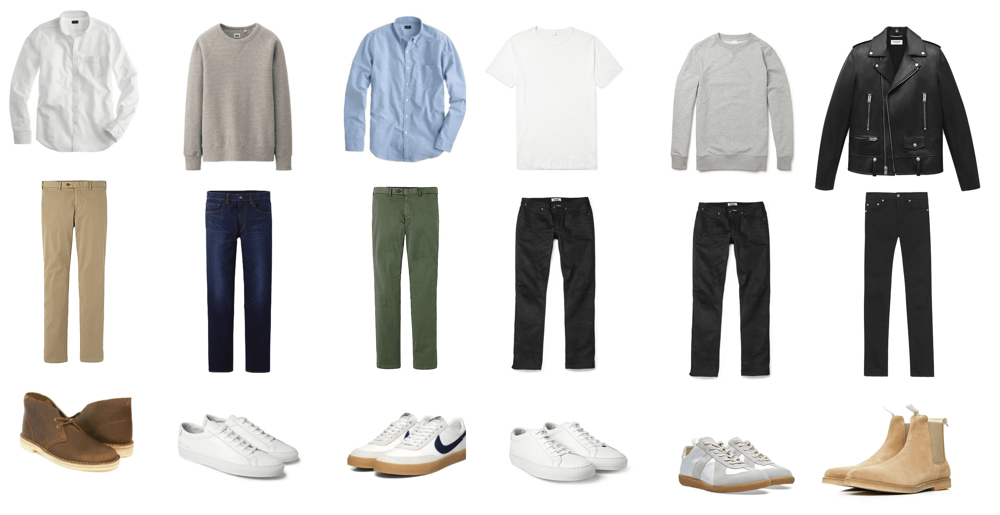

## Aim

What brands are the most popular across Reddit? How does popularity change over time? Is there a gender divide? What brands are talked about positively and negatively? 

To answer these questions I will be conducting a short project using machine learning with Reddit data involving natural language processing (NLP).

## Data collection

I will take data from a purposive sample of fashion-related subreddits. I will use Python to access [Pushshift's API](https://pushshift.io/) to access and download relevant comments and posts to construct a corpus. 

## Date cleaning and pre-processing

Having a clean and processed dataset is crucial for NLP analysis. In addition to [typical pre-processing](https://towardsdatascience.com/topic-modeling-and-latent-dirichlet-allocation-in-python-9bf156893c24) you have to take into account Reddit's custom form of markdown which has to be removed with [redditcleaner](https://pypi.org/project/redditcleaner/). 

## Analysis

To analyse the dataset I will use the [Natural Language Toolkit (NLTK)](https://pypi.org/project/nltk/) library for sentiment analysis of identified brands and topic modelling, specifically Latent Dirichlet Allocation (LDA), to identify in what ways brands are discussed. 

## Further scope

After popularity and sentiment of brands has been tracked I'm keen to explore qualitatively for deeper insights. I expect high positive and negative sentiment to be clustered around certain events, such as articles on slave labour, store closures or product announcements.

