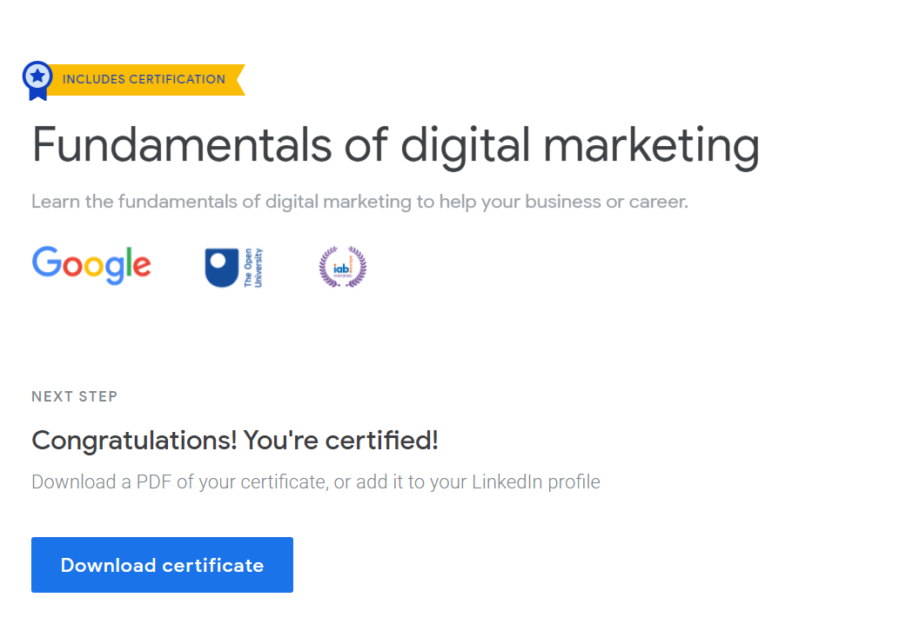

This summer past I decided to take advantage of Google's free course on the [Fundamentals of Digital Marketing](https://learndigital.withgoogle.com/digitalgarage/course/digital-marketing) as a way of up skilling myself. A free certificate at the end and being backed by the Open University and The Internet Advertising Bureau, the industry body for digital advertising in the UK was very attractive.

The course is meant to take 40 hours and has 26 individual modules. Each module is broken up into smaller parts accompanied by multiple videos and short quizzes at the end. At the end of each module is a test which you need to pass to carry on to the next module. Finally, after completing all module you have a final exam which you must score 80% on to pass.

## The main topics covered were:

* Search Engine Optimisation (SEO)
* Search Engine Marketing (SEM)
* Content marketing
* Local Advertising
* Display Ads
* Web and data analysis
* Retargeting
* Email Marketing
* E-commerce
* Global marketing and opportunities

## What I found useful

Having a qualification which is from Google and certified by a University and an industry body certainly adds a component of *social proof*. A psychological term which in this case means the information comes from an expert perspective which lends it credibility. Both showing off the certificate as a credential but also makes you feel like you're spending your time on something worthwhile. I mean, it's not a course from a random blog, now is it?

Google is accurate on the 'fundamentals' part, it gives a good and brief overview of different marketing channels. It gives a good horizon scan of the current industry while also giving you further reading and links. Admittedly to most of Google's other services and products.

Three small things I found useful was that it tracked how far you were with module completed while working at your own pace. Firstly, on your rate of completing modules it was easy to ballpark how long it would take me overall instead of relying on the 40 hours recommendation. Secondly you could speed up each video when the speaker was a bit slow. Lastly, under each video was a correctly transcript. These sound like minor things but I've taken some dreadful online courses in the past.

## The bottom line

Is it worth it? Yes. It's free!

If you want to dabble and gain an overview of digital marketing I would strongly recommend the course. If you are trying to gain employment in the industry I would use this as a great starting point while creating  an online presence and portfolio.

## Personal outcomes

Throughout writing blog posts, [creating this website](https://naiyanjones.com/technology/how-i-built-this-website/) and even writing this article I am reminded of what I learnt. From the importance of content marketing, keyword SEO use and [optimising content for low internet speed and devices.](https://naiyanjones.com/technology/optimising-website-images-with-python/)
